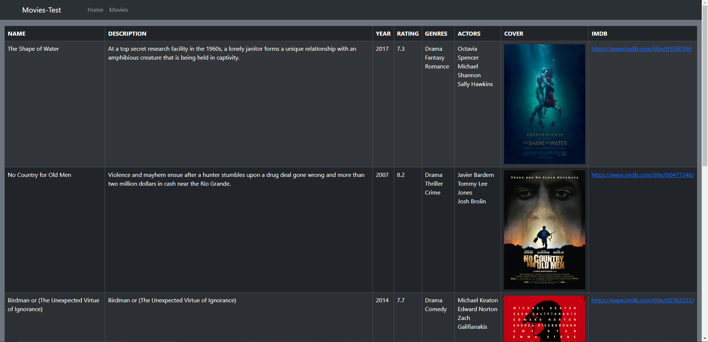
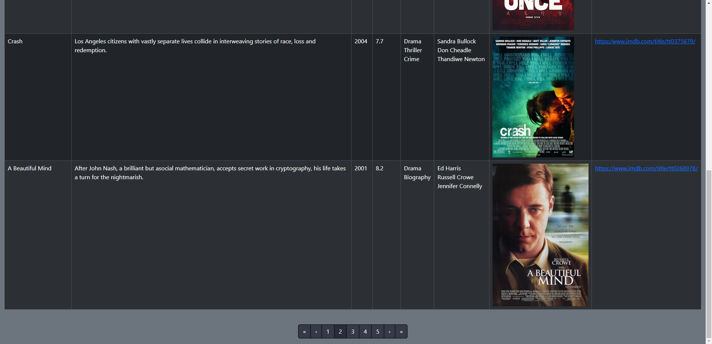

# .NET-Movies-Test

## Description
This is a fullstack application test that displays information about various movies from 
a given movies.json data file.

## The stack:
- ASP.NET Core Web API for backend side
- React Vite with TS for frontend side
- PostgreSQL database for data persistance
- Docker for deployment

## Installation
1. Above the list of files, click <>Code.
2. Copy the desired URL for the repository (HTTPS, SSH), or use Github CLI.
3. Open Git Bash on your machine.
4. Change the current working directory to the location where you want the cloned directory:
    ```bash
        cd <workdir_name>
    ```
5. Type git clone, and then paste the URL you copied earlier:
    ```bash
        git clone <copied_URL>
    ```
6. If you have Docker installed, make sure you are in the project directory, open a terminal and type:
   ```bash
      docker-compose up --build
   ```
7. Open the browser of choice and paste the default frontend URL: https://localhost:5173 is the default one;
8. To stop, simply press CTRL+C in the same terminal you used above. If you find it easier, use the Docker app to start, close and monitor the services.

## Required Information
By default, the deployed services are set up to run on their specific localhosts:
   - backend will run on port 5001;
   - frontend will run on port 5173;
   - database will run on port 5432;

If you wish to change these settings:
1. Frontend (all have to be the same):
   - navigate to vite.config.ts file in the *project_folder/Client* folder and change the port to your desired one;
   - navigate to the Dockerfile in the *project_folder/Client* folder and change the EXPOSE port and change the port to your desired one;
   - navigate to docker-compose.yml file in the project folder and change the port in the frontend service change the port to your desired one;
2. Backend (all have to be the same):
   - navigate to appsettings.json file in *project_folder/API/API* and change the URL in the Kestrel key to your desired one;
   -  navigate to the Dockerfile in the *project_folder/API* folder and change the EXPOSE port and change the port to your desired one;
   - navigate to docker-compose.yml file in the project folder and change the port in the backend service and change the port to your desired one;
3. Database:
   - navigate to docker-compose.yml file in the project folder and change the port in the database service and change the port to your desired one;
   - navigate to docker-compose.yml file in the project folder and change the port in the backend service -> environment -> connection_string and change the port to your desired one;

Additionally, you will have update the connection string for database with your postgreSQL credentials:
   - USERNAME
   - PASSWORD

## Visuals

### Movies page




## Final Note
Unfortunately, because of my desired frontend technology choice, the actual frontend code is mostly running in browser, including the fetch.

Ultimately, this means it has no idea about the Docker network that the containers use, or the fact that they have different localhosts.

The dependency is not enough. The fetching should have been done on the same server that serves the frontend code to the browser. In this sense I should have used React NEXT JS for example, instead of React Vite.

This is why, despite all services running, you might not be able to see the data on frontend.